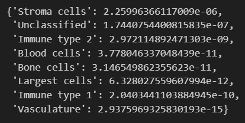

<h1 align="center">Spatial Omics</h1>
<h2 align="center">Задание на анализ данных пациентов с плоскоклеточным раком</h2>

## Оглавление

[1. Описание прокта](#1-описание-проекта)

[2. Описание датасета](#2-описание-датасета)

[3. Задачи](#3-задачи)

[4. Выводы]()

## 1. Описание проекта

Отработка навыков статистического анализа данных на языке Pytnon на биоинформатическом датасете по простанственной [транскриптомике](https://institut-curie.org/popin/spatial-omics) пациентов с плоскоклеточным раком.

## 2. Описание датасета

Датасет содержит следующие признаки:

- *cell_type* - тип клетки;

- *cell_interaction* - клеточное микроокружение;

- *age_group* - возрастная группа пациента;

- *distance_to_vasculature* — расстояние до ближайших сосудов;

- *distance_to_largest_cell* — расстояние до ближайшей крупной клетки;

- *immune_marker_1* — экспрессия иммунного маркера 1 в данной клетке;

- *immune_marker_2* — экспрессия иммунного маркера 2 в данной клетке;

- *area_of_cell* — размер клетки;

- *case_id* — уникальный ID пациента.

## 3. Задачи

### Задание 1

Есть ли стат-значимость между типом клетки и:

а) Размером клетки (*area_of_cell*), добавьте 'hue' по возрастным группам.

б) Экспрессией иммунных маркеров (*immune_marker_1*, *immune_marker_2*), добавьте 'hue' по возрастным группам.

в) Дистанцией до ближайших объектов (*distance_to_vasculature*, *distance_to_largest_cell*), добавьте hue по возрастным группам.
В качестве ответов можно приводить 'box_plot'/'swarplot', где по одной оси будет тип клеток, а по другой — оцениваемая вами статистика.

### Задание 2

В каком клеточном микроокружении клеток какого типа статистически больше, чем в других микроокружениях? (колонка *cell_interaction*). Для ответа используйте 'box_plot'/'swarplot' с 'hue' по микроокружениям, где:

- по $О_х$ будут типы клеток,
- по $О_у$ — их количество.

Не забудьте посчитать количество для каждого пациента отдельно, иначе выборка не будет репрезентативной.

### Задание 3

Есть ли разница в доле микроокружения в тканях пациентов разных возрастов? Для ответа используйте 'box_plot'/'swarplot' с 'hue' по возрастным группам, где:

- по $О_х$ будут микроокружения,

- по $О_у$ — их доля в ткани пациента.

Не забудьте посчитать доли для каждого пациента отдельно, иначе выборка не будет репрезентативной.

### Задание 4

Правда ли, что иммунные клетки ('Immune type 1' и 'Immune type 2') лежат ближе к сосудам и крупным клеткам (Обе колонки *distance*), чем стромальные клетки ('Stroma cells') у молодых, но не у пожилых пациентов? Эту гипотезу нужно проверить бутстрапом (как разницу средних для двух выборок).

### Задание 5

Правда ли, что иммунные клетки в среднем лежат ближе к сосудам у молодых, но не у пожилых пациентов? Эту гипотезу необходимо проверить пермутационным тестом. В качестве исходной статистики берем массив с расстояниями только для данного типа клеток (длина - n), запоминаем среднее для каждого пациента. На каждой итерации набираем выборку размером n из всей! колонки с расстояниями до сосудов и смотрим соотношение с исходной статистикой. Проверяем гипотезы. Комбинировать p-values для каждой возрастной группы можно с помощью [этого инструмента](https://docs.scipy.org/doc/scipy/reference/generated/scipy.stats.combine_pvalues.html).

## Выводы

### Выводы по заданию 1

#### Задание 1_а
1) Проверка на нормальность показала следующие результаты:

Значит можно сделать вывод о том, что выборка не подчиняется нормальному закону распределения.

2) В ходе проведения статистического теста были получены следующие результаты:

Таким образом, на основе данных теста Краскела-Уоллиса можно сделать вывод о наличии статистически значимой связи между типом клетки и размером клетки с учетом возрастных групп, у всех типов клеток кроме 'Blood cells' и 'Vasculature'

3) Оценка значимости и величины эффекта была проведена с помощью коэффициента ранговой корреляции Кендалла (Kendall's W)

Коэффициенты указывают на очень слабую связь. 

4) Ограничения проведенного анализа могут следующими:

- *Влияние возрастной группы.* Возможны взаимодействия между возрастной группой и другими пременными, которые не были учтены;

- *Внутригрупповая изменчивость.* Могут быть неучтенные факторы, которые влияют на размер клетки внутри каждой возрастной группы, такие как пол пациента, его общее состояние здоровья, лечение и т.д.

- *Выбросы.*

Для улучшения и минимизации ограничений можно воспользоваться следующим:

- Множественная проверна гипотез;

- Детализация анализа (проведение анализа с учетом дополнительных признаков);

- Нелинейные методы;

- Построение дополнительных графиков;

- Разработка предиктивных моделей;

- Более тщательный анализ выбросов и их обработка.

#### Задание 1_б
1) Проверка на нормальность показала следующие результаты:

immune_marker_1

immune_marker_2

Значит можно сделать вывод о том, что выборки не подчиняются нормальному закону распределения.

2) В ходе выполнения теста Краскела-Уоллиса были полученны следующие результаты:

immune_marker_1

immune_marker_2

Таким образом, на основе данных теста Краскела-Уоллиса можно сделать вывод о наличии статистически значимой связи между всеми типами клеток и immune_marker_1 с учетом возрастных групп. А в immune_marker_2 отсутсвует статистически значимая связь для 'Blood cells' и 'Largest cells'. 

3) Оценка значимости и величины эффекта была проведена с помощью коэффициента ранговой корреляции Кендалла (Kendall's W)

immune_marker_1

immune_marker_2

Коэффициенты указывают на очень слабую связь.

4) Ограничения проведенного анализа могут следующими:

- *Влияние возрастной группы.* Возможны взаимодействия между возрастной группой и другими пременными, которые не были учтены;

- *Выбросы.*

Для улучшения и минимизации ограничений можно воспользоваться следующим:

- Множественная проверна гипотез;

- Детализация анализа (проведение анализа с учетом дополнительных признаков);

- Нелинейные методы;

- Построение дополнительных графиков;

- Разработка предиктивных моделей;

- Более тщательный анализ выбросов и их обработка.

#### Задание 1_в

1)  Проверка на нормальность показала следующие результаты:

distance_to_vasculature

distance_to_largest_cell

2) В ходе выполнения теста Краскела-Уоллиса были полученны следующие результаты:

distance_to_vasculature

distance_to_largest_cell

Таким образом, на основе данных теста Краскела-Уоллиса можно сделать вывод о наличии статистически значимой связи для:
- *distance_to_vasculature* со всеми типами клеток кроме *Vasculature*;
- *distance_to_largest_cell* со всеми типами клеток кроме *Largest cells*, *Immune type 1*, *Vasculature*.

3) Оценка значимости и величины эффекта была проведена с помощью коэффициента ранговой корреляции Кендалла (Kendall's W)

distance_to_vasculature

distance_to_largest_cell

Коэффициенты указывают на очень слабую связь.

4) Ограничения проведенного анализа могут следующими:

- *Влияние возрастной группы.* Возможны взаимодействия между возрастной группой и другими пременными, которые не были учтены;

- *Выбросы.*

Для улучшения и минимизации ограничений можно воспользоваться следующим:

- Множественная проверна гипотез;

- Детализация анализа (проведение анализа с учетом дополнительных признаков);

- Нелинейные методы;

- Построение дополнительных графиков;

- Разработка предиктивных моделей;

- Более тщательный анализ выбросов и их обработка.

### Выводы по заданию 2

1) По построенным boxplot:

Можно сделать следующие выводы о среднем количестве клеток:

- В микроокружении 4 статистически больше чем в других микроокружениях клеток типа *Stroma Cells*;

- В микроокружении 2 статистически больше чем в других микроокружениях клеток типа *Unclassified*;

- В микроокружении 1 статистически больше чем в других микроокружениях клеток типа *Immune type 2*;

- В микроокружении 5 статистически больше чем в других микроокружениях клеток типа *Immune type 1*;

- остальные типы клеток содержатся в очень малом количестве во всех микроокруженях.

2) Проверка на нормальность:

3) В ходе выполнения теста Краскела-Уоллиса были полученны следующие результаты:

Можно сделать следующие выводы: 

- *Blood cells*: K-статистика равна 13.59, и p-value равно 0.018, что меньше обычного порога значимости 0.05, указывая на то, что медианы хотя бы в двух группах значимо различаются.

- *Bone cells*: K-статистика равна 16.99, и p-value равно 0.0045, что также указывает на значимые различия между группами.

- *Immune type 1* и *Immune type 2*: p-value больше 0.05, что означает, что нет достаточных доказательств, чтобы отвергнуть нулевую гипотезу о равенстве медиан в группах.

- *Largest cells*: K-статистика равна 23.78, и p-value очень маленькое (0.000238), что указывает на очень сильные доказательства того, что медианы в группах различаются.

- *Stroma cells* и *Unclassified*: Оба имеют p-value меньше 0.05, указывая на статистически значимые различия между группами.

- *Vasculature*: p-value равно 0.715, что значительно выше 0.05, и следовательно различия между группами не считаются статистически значимыми.

Post-hoc Dunn test: Этот тест выполняется после того, как тест Краскела-Уоллиса показал значимые различия, чтобы определить, какие конкретные группы различаются между собой.
Для типов клеток Blood cells, Bone cells, Largest cells, Stroma cells, и Unclassified, где p-value теста Краскела-Уоллиса было меньше 0.05, был выполнен тест Данна:

### Выводы по заданию 3
1) Построим boxplot:

По графику мы можем предварительно сказать, что разница в доле микроокружения в тканях пациентов разных возрастов есть.

2) По результатам теста Колмогорова-Смирнова: 

Можно сделать вывод о нормальности распределения

3) Так как выборка подчиняется закону нормального распределения проверим предположение о гомогенности дисперсий между группами (тест Левена).

4) Раз предположения о нормальности и гомогенности дисперсий выполнены, можно использовать двухфакторный дисперсионный анализ (two-way ANOVA) с cell_interaction и age_group в качестве факторов.

Для *C(cell_interaction):C(age_group)*: p-value (0.001439) меньше 0.05, что говорит о статистически значимом взаимодействии между cell_interaction и age_grou

Таким образом, на основании результатов, можно сделать вывод о наличии разницы в доле микроокружения в тканях пациентов разных возрастов.

### Выводы по заданию 4
1) В результате бутстрапа и расчет доверительных интервалов получили следующее:

Интерпретируя эти результаты, важно отметить, что доверительные интервалы не включают ноль, что указывает на статистически значимую разницу между средними значениями расстояния до сосудов и крупнейшей клетки в обеих возрастных группах. Все интервалы отрицательны, что говорит о том, что во всех случаях первая группа клеток - иммунные клетки в среднем расположена ближе к интересующим объектам, чем вторая группа клеток - стромальные клетки.

### Выводы по заданию 5

В результате провдеения пермутационного теста были получены следующие результаты:

Таким образом, у нас есть значительные доказательства в пользу альтернативной гипотезы, что иммунные клетки в среднем находятся ближе к сосудам у молодых, но не у пожилых пациентов.